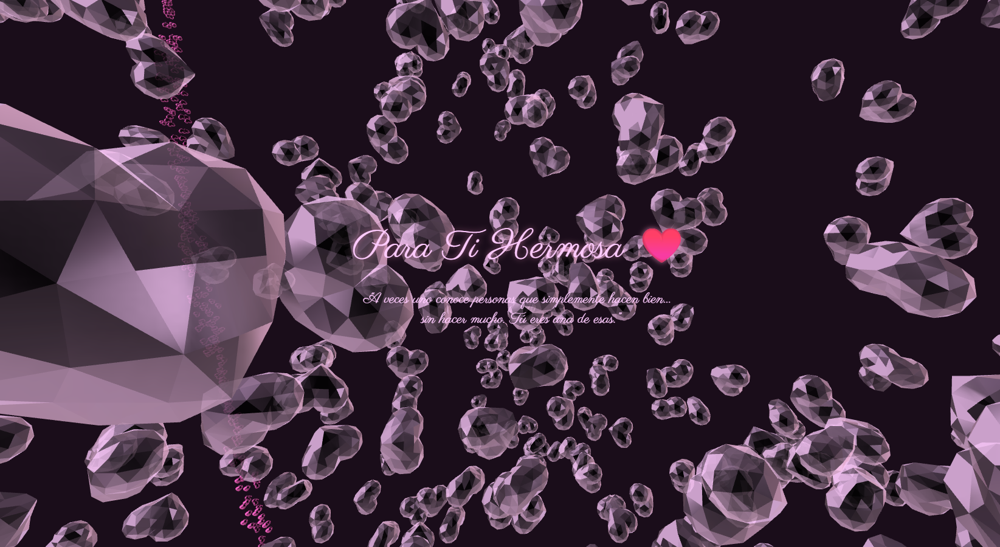

# 💕 Beautiful CSS Project


<p align="center">
  
</p>

Una página web hermosa e interactiva creada con HTML y CSS, con efectos visuales impactantes y animaciones elegantes.

## 📋 Descripción

Este proyecto presenta una experiencia visual inmersiva con:
- **Gradiente de fondo dinámico**: Colores suave degradados en tonos morados oscuros
- **Animaciones fluidas**: Transiciones y efectos fade-in elegantes
- **Interfaz interactiva**: Botón de reproducción con efectos hover
- **Tipografía personalizada**: Fuentes de Google Fonts y Typekit
- **Diseño responsivo**: Compatible con dispositivos de diferentes tamaños

## 🎨 Características Principales

- Efecto WebGL para gráficos avanzados
- Botón de reproducción circular centrado con animaciones
- Contenedor de introducción con texto personalizado
- Paleta de colores coherente (rosa y púrpura)
- Animaciones CSS modernas y transiciones suaves

## 📁 Estructura del Proyecto

```
Love_beautifull/
├── index.html    # Archivo HTML principal con estilos integrados
└── README.md     # Este archivo
```

## 🚀 Cómo Usar

1. Abre el archivo `index.html` en tu navegador web
2. Disfruta de las animaciones y efectos visuales
3. Interactúa con los elementos de la página

## 🛠️ Tecnologías Utilizadas

- **HTML5**: Estructura base de la página
- **CSS3**: Estilos, animaciones y efectos visuales
- **Google Fonts**: Tipografía (Parisienne)
- **Adobe Typekit**: Fuentes adicionales
- **WebGL**: Gráficos avanzados (canvas)

## 🎯 Requisitos

- Navegador web moderno (Chrome, Firefox, Safari, Edge)
- Conexión a internet (para cargar fuentes externas)

## 📝 Notas

- El proyecto utiliza estilos CSS inline en el HTML
- Implementa animaciones CSS puras sin dependencias externas
- El diseño está optimizado para pantalla completa

## 👤 Autor

Proyecto creado como parte del portfolio de Whoamy2p.

---

⭐ Si este proyecto te agrada, considera compartirlo o darle una estrella.
